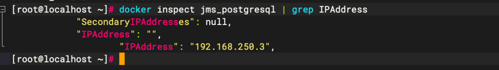

# jumpserver_decrypto

## 🚀attention🚀

对jumpserver的数据库做解密,使用前记得修改config.py里面的配置文件。

解密失败请先查看config.py里面的SECRET_KEY是否正确。

SECRET_KEY在/opt/jumpserver/config/config.txt文件中。

快速获取内置postgresql/mysql的容器地址(host)
```text
docker inspect jms_postgresql | grep IPAddress
```


要求最低使用python3.8版本。

## **🐍**python3.9 install**🐍**

一站式python3.9安装

```
bash <(curl -sSL https://linuxmirrors.cn/main.sh)
yum update -y
yum install -y openssl-devel sqlite-devel libffi-devel gcc wget
yum install -y postgresql-devel python3-devel
yum install -y freetype-devel xz-devel
wget https://www.python.org/ftp/python/3.9.12/Python-3.9.12.tar.xz
tar -xf Python-3.9.12.tar.xz
cd Python-3.9.12/
./configure --prefix=/usr/local/python39 --enable-shared
make && make install
ln -sf /usr/local/python39/bin/python3 /usr/bin/python3
ln -sf /usr/local/python39/bin/pip3 /usr/bin/pip3
ln -sf /usr/local/python39/lib/libpython3.9.so.1.0 /usr/lib64/libpython3.9.so.1.0
```

## **✨**Getting started**✨**

将导出的jumpserver sql文件导入到数据库，修改config文件中的相关配置，直接运行main即可(为避免污染主机环境，建议使用虚拟环境)

```
python3 -m venv .venv
source .venv/bin/activate
pip3 install -r requirements.txt 
python3 main.py
```


## 📌update log
2025.08.25
    ·增加 PostgreSQL 数据库适配(V4系列默认使用postgresql)