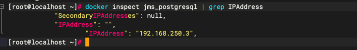

# jumpserver_decrypto

对 JumpServer 数据库账号密文做解密，输出 `jumpserver.csv`。

## 🚀注意事项

1. 请确认 `SECRET_KEY` 正确，否则会解密失败。`SECRET_KEY` 常见位置：`/opt/jumpserver/config/config.txt`
2. 快速获取数据库容器地址（host）：

```bash
docker inspect jms_postgresql | grep IPAddress
```


mysql同理
```bash
docker inspect jms_mysql | grep IPAddress
```

## ✨推荐用法：直接下载二进制✨

GitHub Actions 会自动构建并发布以下平台二进制：

1. `jumpserver_decrypto_linux_x64`
2. `jumpserver_decrypto_linux_arm64`
3. `jumpserver_decrypto_macos_arm64`
4. `jumpserver_decrypto_windows_x64.exe`

使用步骤：

1. 从 Release 下载对应平台二进制。
2. 在二进制同目录放置配置文件（推荐 `config.txt`）。
3. 运行二进制，执行完成后会在当前目录生成 `jumpserver.csv`。

Linux:

```bash
chmod +x ./jumpserver_decrypto_linux_x64
./jumpserver_decrypto_linux_x64
```

macOS:

```bash
chmod +x ./jumpserver_decrypto_macos_arm64
./jumpserver_decrypto_macos_arm64
```

Windows (PowerShell):

```powershell
.\jumpserver_decrypto_windows_x64.exe
```

## 配置文件说明（支持二进制相对目录读取）

程序会按以下优先顺序查找配置文件：

1. `config.yaml`
2. `config.yml`

查找位置：

1. 当前工作目录
2. 可执行文件所在目录（或源码目录）

`config.txt` 示例（推荐）：

```yaml
database:
  type: 1            # 1=MySQL, 2=PostgreSQL
  host: "127.0.0.1"
  port: 3303
  user: "root"
  password: "root"
  name: "jumpserver"
  secret_key: "NGM0YzQ1NDQtMDA1Mi0zNTEwLTgwNGUtYzNjMDRmMzM1NzMx"
```

字段说明：

1. `type=1` 表示 MySQL
2. `type=2` 表示 PostgreSQL
3. 必填：`host`、`port`、`user`、`password`、`database`、`SECRET_KEY`

## 源码运行（Python 3.12）
如果你要本地直接跑源码，直接运行`main.py`即可，建议使用 Python3.12(为避免污染主机环境，建议使用虚拟环境)：
```
python3.12 -m venv .venv
source .venv/bin/activate
python -m pip install --find-links vendor -r requirements.txt
python main.py
```

## CI 自动打包说明

`.github/workflows/release.yml` 已支持自动构建：

1. Windows x64
2. macOS arm64
3. Linux x64
4. Linux arm64

触发方式：

1. 推送 tag（如 `v1.0.0`）
2. 手动触发 `workflow_dispatch`


## 📌update log
2025.08.25
- 增加 PostgreSQL 数据库适配(V4系列默认使用postgresql)

2026.04.22
- Python 版本升级到 3.12
- 新增自动打包 Windows/macOS/Linux 三端
- 支持在二进制相对目录读取`config.yml`并解密